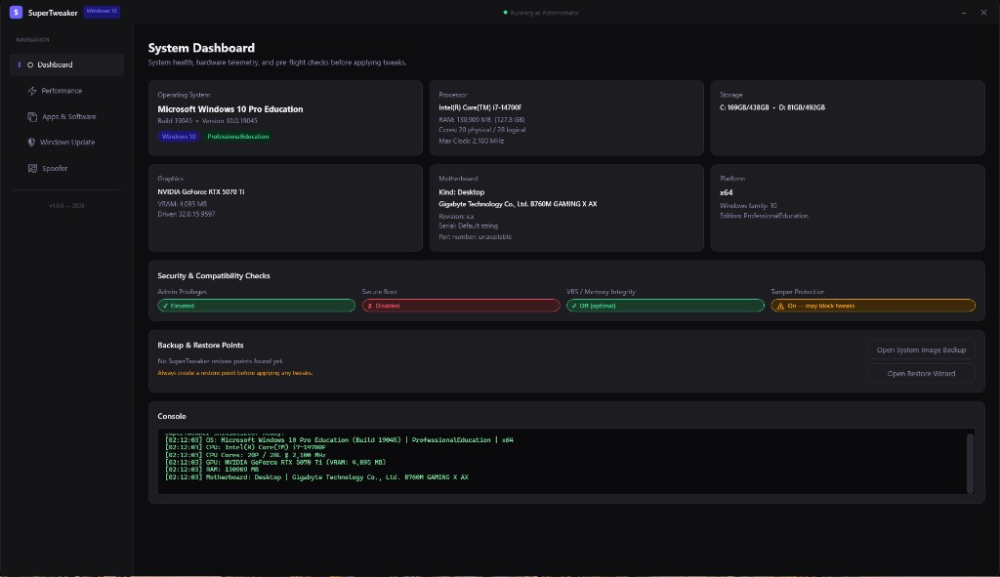
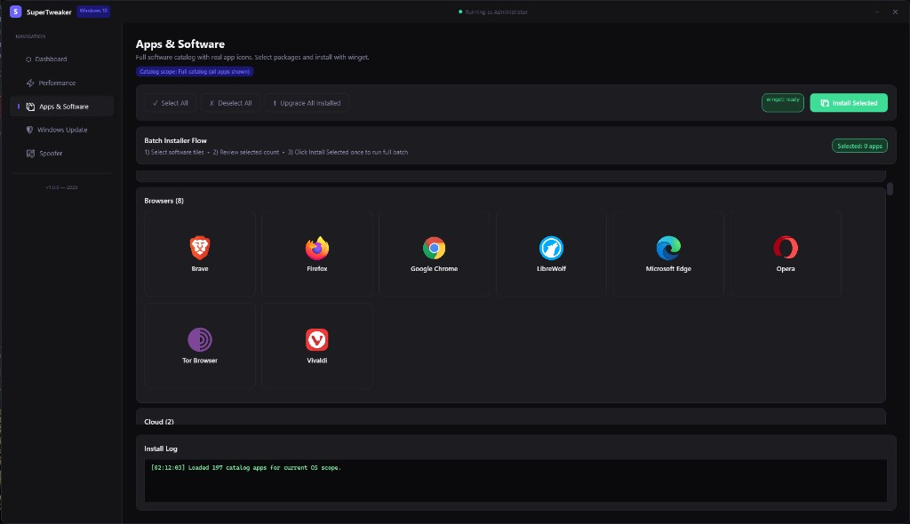

# SuperTweaker

<div align="center">

**All-in-one Windows optimization for power users**

[](https://dotnet.microsoft.com/)
[](https://www.microsoft.com/windows)
[](https://learn.microsoft.com/dotnet/desktop/wpf/)
[](https://xunit.net/)

*Modern WPF shell · JSON-driven profiles · Administrator-required operations*

[](https://github.com/BendaZ/SuperTweaker/releases/latest/download/SuperTweaker-1.0.0-x64.msi)
[](https://github.com/BendaZ/SuperTweaker/releases/latest/download/SuperTweaker-1.0.0-win-x64-portable.zip)
[](https://github.com/BendaZ/SuperTweaker/releases)

**Direct links (latest v1.0.0):** [SuperTweaker-1.0.0-x64.msi](https://github.com/BendaZ/SuperTweaker/releases/latest/download/SuperTweaker-1.0.0-x64.msi) · [SuperTweaker-1.0.0-win-x64-portable.zip](https://github.com/BendaZ/SuperTweaker/releases/latest/download/SuperTweaker-1.0.0-win-x64-portable.zip) (self-contained single-file app + `Data/` / `Assets/`)

</div>

---

## Screenshots

### System Dashboard

<p align="center">
  
</p>

### Apps & Software

<p align="center">
  
</p>

---

## Overview

**SuperTweaker** is a native Windows desktop application that brings system health visibility, one-click **Golden Setup** optimization, software deployment via **winget**, optional **Windows Update** policy control, and a scoped **spoofer** for MAC and user-mode hardware identifiers—inside a single, cohesive interface.

The app is built for **64-bit Windows 10 and Windows 11**, requests **Administrator** privileges at launch (required for services, registry, and WMI operations), and uses **data-driven JSON profiles** so advanced users can tune behavior without recompiling.

---

## Why SuperTweaker?

| Capability | What you get |
|------------|----------------|
| **Visibility first** | Dashboard summarizes OS, CPU, RAM, GPU, storage, motherboard, and security posture (Secure Boot, VBS, Tamper Protection). |
| **Controlled optimization** | Golden Setup applies only the tweaks you select, with **dry run**, **manifest-based revert**, and **restore point** integration. Long applies can be **cancelled** from the UI. |
| **Post-apply automation** | Optional **Sophia Script** (winget: `TeamSophia.SophiaScript`) in a narrow performance mode, then **Hellzerg Optimizer** (`Hellzerg.Optimizer`) with a patched JSON template—see [Performance](#performance--golden-setup). |
| **Software hub** | **Catalog** plus **remote icon URLs** (raster/SVG), **local icon cache**, **batch install** with progress and install log; **winget** install and **upgrade all**. |
| **Update governance** | Disable or re-enable Windows Update with explicit service, task, and policy targets—see [Windows Update](#windows-update). |
| **Scoped spoofing** | MAC (`NetworkAddress`) and user-mode HWID-related values, optional **hostname** randomization, with backup snapshots—not kernel or firmware spoofing. |

---

## Feature tour

### Dashboard

- Hardware and OS telemetry (WMI-backed).
- **Security & compatibility** badges: elevation, Secure Boot, VBS / Memory Integrity, Tamper Protection.
- **Restore points** associated with SuperTweaker, plus shortcuts to **System Image Backup** and **Restore Wizard**.
- Live **console** output for initialization and diagnostics.

### Performance — Golden Setup

- Loads OS-specific profiles: `golden-win11.json` on Windows 11, otherwise `golden-win10.json` (including when the OS is not detected as 10 or 11).
- Per-tweak **checkboxes**, **Select All** / **Deselect All**.
- **Step 1 — Safety Net** card with shortcuts to system image backup and restore tools; pre-apply confirmation for a **full system image** workflow on critical machines.
- **Apply Golden Setup** runs the pipeline; **Dry Run** validates without changing the system.
- **Revert (Manifest Undo)** rolls back changes recorded in the tweak manifest (when applicable).
- Automatic **restore point** creation before apply (subject to Windows throttling—typically one per 24 hours).
- **Progress** bar and **Cancel** during apply.
- Optional **Sophia Script** (unchecked to skip): installed via **winget** as **`TeamSophia.SophiaScript`** when needed. The app invokes `Sophia.ps1` with **`-Functions`** only—no full Sophia preset or interactive UWP uninstall—using performance-oriented calls equivalent to: **DiagTrack service disabled**, **diagnostic data minimal**, **high performance power plan**. Does **not** schedule a system restart.
- Optional **Hellzerg Optimizer** (unchecked to skip): resolved or installed via **`Hellzerg.Optimizer`** (`winget install Hellzerg.Optimizer` if missing). Runs **`Optimizer.exe /config="…"`** with a **built-from-template** JSON under `Data/optimizer/hellzerg-base-win10.json` or `hellzerg-base-win11.json`. This step is the **only** one that may schedule a **normal restart** after Optimizer finishes (per Hellzerg post-action).

### Apps & Software

- **Software catalog** from `apps-catalog.json`: categories, **winget** package IDs, default selections, and optional **per-app icon URLs**.
- Icons render via **SkiaSharp** / **Svg.Skia** (PNG, JPG, SVG). Fetched icons are stored under **`%LocalAppData%\SuperTweaker\IconCache`** for faster repeat loads.
- **Batch Installer Flow**: select tiles → review **selection count** → **Install Selected** runs one batch; **Upgrade All Installed** uses winget across the catalog scope.
- **Install progress** bar and **Install Log** panel; **winget** availability badge in the toolbar.

### Windows Update

- Read **service** and **Group Policy** style block status; **Refresh Status** anytime.
- **Disable** or **re-enable** Windows Update through coordinated changes. The UI documents what is touched:

| Area | Items |
|------|--------|
| **Services** | `wuauserv` (Windows Update), `UsoSvc` (Update Orchestrator), `WaaSMedicSvc` (self-healer), `BITS`, `dosvc` (Delivery Optimization) |
| **Tasks & policy** | Five **Windows Update** scheduled tasks; AU policies **NoAutoUpdate** and **DisableWindowsUpdateAccess**; **WaaSMedicSvc** registry lock |

- Prominent warnings: disabling updates removes security patches—use only where you understand the tradeoff.
- **Log** panel for operation output.

### Spoofer

- **MAC address** spoofing per adapter via registry (`NetworkAddress`), with adapter listing, **random MAC**, apply, **restore original**, and **refresh adapters**.
- **User-mode HWID-related identifiers** (e.g. `MachineGuid`, `HwProfileGuid`, `SqmMachineId`, `ProductId`, `SusClientId`; UI also surfaces **ComputerName** and **InstallDate** for visibility) within documented scope.
- Optional checkbox: **randomise computer hostname** (effective after **reboot**), in addition to registry identifiers.
- **Backup snapshot** and **revert from latest snapshot** for spoof-related values.
- Explicit limitation: **no** kernel, SMBIOS, or EFI spoofing (would require signed drivers and is out of scope).
- **Spoofer Log** panel.

---

## Architecture (high level)

```text
SuperTweaker/
├── SuperTweaker.sln
├── SuperTweaker/                 # WPF application (net8.0-windows, x64)
│   ├── Core/                     # Logger, WindowsInfo, WMI, PowerShell, services, restore points, winget
│   ├── Modules/
│   │   ├── GoldenSetup/          # Profiles, TweakApplier, manifest, Sophia/Hellzerg post-steps
│   │   ├── UpdateControl/        # UpdateManager
│   │   └── Spoofer/              # MAC + HWID user-mode helpers
│   ├── Views/                    # Dashboard, Performance, Apps, Updates, Spoofer tabs
│   └── Data/
│       ├── profiles/             # golden-win10.json, golden-win11.json
│       ├── apps/                 # apps-catalog.json
│       └── optimizer/            # hellzerg-base-*.json templates
└── SuperTweaker.Tests/           # xUnit + FluentAssertions (shared core compile links)
```

**Primary dependencies:** `System.Management` (WMI), `System.ServiceProcess.ServiceController`, `System.Text.Json`, **SkiaSharp** / **Svg.Skia** for icon rendering.

---

## Requirements

| Requirement | Notes |
|-------------|--------|
| **OS** | Windows 10 or Windows 11 (x64) |
| **Runtime / SDK** | [.NET 8 SDK](https://dotnet.microsoft.com/download/dotnet/8.0) (for build); Windows Desktop runtime for running published output |
| **Elevation** | Application manifest: `requireAdministrator` |
| **Optional** | **winget** (App Installer) for Apps tab, Sophia (`TeamSophia.SophiaScript`), and Hellzerg (`Hellzerg.Optimizer`) post-apply steps |

---

## Build & run

Clone the repository and open `SuperTweaker/SuperTweaker.sln` in **Visual Studio 2022** (or use the CLI from the repository root).

**Restore and build (Release, x64 — matches project platform):**

```bash
dotnet restore SuperTweaker/SuperTweaker.sln
dotnet build SuperTweaker/SuperTweaker.sln -c Release /p:Platform=x64
```

**Run the desktop app:**

```bash
dotnet run --project SuperTweaker/SuperTweaker/SuperTweaker.csproj -c Release /p:Platform=x64
```

Or launch `SuperTweaker.exe` from:

`SuperTweaker/SuperTweaker/bin/x64/Release/net8.0-windows/`

**Run tests:**

```bash
dotnet test SuperTweaker/SuperTweaker.sln
```

The test suite includes dry-run integration checks, Golden Setup read-only validation, and `UpdateManager` state inspection **without** applying destructive changes.

---

## Release artifacts (MSI & portable)

Prebuilt **MSI** and **portable ZIP** for the current version are linked in the **download badges** at the top of this README and on [**GitHub Releases**](https://github.com/BendaZ/SuperTweaker/releases). Binaries are **not** stored in the repository (`artifacts/` is gitignored).

| Download | Description |
|----------|-------------|
| [**MSI**](https://github.com/BendaZ/SuperTweaker/releases/latest/download/SuperTweaker-1.0.0-x64.msi) | WiX **per-machine** installer → `%ProgramFiles%\SuperTweaker`. |
| [**Portable ZIP**](https://github.com/BendaZ/SuperTweaker/releases/latest/download/SuperTweaker-1.0.0-win-x64-portable.zip) | Extract anywhere; **self-contained** **single-file** `SuperTweaker.exe` with `Data/` and `Assets/` beside it (no separate .NET runtime). |

**Local build (Windows, PowerShell):**

```powershell
cd <repo-root>
dotnet tool restore
./scripts/Build-ReleaseArtifacts.ps1 -Version 1.0.0
```

Outputs appear under `artifacts/`. WiX is pinned in `dotnet-tools.json` (`wix` 5.0.2).

**Version bump:** Keep in sync: `SuperTweaker/SuperTweaker/SuperTweaker.csproj` (`<Version>`), `installer/SuperTweaker.Package.wxs` (`Package` **Version** must be `x.x.x.x`), and the `-Version` argument to the script.

**GitHub:** Use **Actions → Build release artifacts → Run workflow** (manual dispatch). Download the uploaded **MSI** and **portable ZIP** artifacts, then attach them when you create a **Release** on GitHub (this repo does not auto-publish releases).

---

## Configuration & data files

These files are copied next to the executable (under `SuperTweaker/SuperTweaker/Data/…` in source) so you can **edit them without rebuilding**:

| Path (relative to app output) | Purpose |
|--------------------------------|---------|
| `Data/profiles/golden-win10.json` | Golden Setup tweak list for Windows 10 |
| `Data/profiles/golden-win11.json` | Golden Setup tweak list for Windows 11 |
| `Data/apps/apps-catalog.json` | Apps & Software catalog (including optional `iconUrl` fields) |
| `Data/optimizer/hellzerg-base-win10.json` | Hellzerg template base (Win10); patched at runtime |
| `Data/optimizer/hellzerg-base-win11.json` | Hellzerg template base (Win11); patched at runtime |

Follow the JSON schema and conventions already present in each file when extending profiles or catalog entries.

---

## Safety & responsibility

- **Backups:** Use restore points, system images, and Spoofer snapshots before irreversible changes.
- **Windows Update:** Disabling updates is appropriate only for controlled or offline scenarios; re-enable before exposing the PC to untrusted networks.
- **Spoofer:** Use only in compliance with applicable laws and service terms. This tool does not bypass hardware attestation at the firmware level.
- **Golden Setup / Sophia / Hellzerg:** Review each tweak; dry run first on non-production systems. Hellzerg may schedule a restart—save work first.

---

## Version

Application version **1.0.0** (see `SuperTweaker/SuperTweaker/SuperTweaker.csproj`). The UI displays the product tagline and year in the navigation footer.

---

## Contributing

Contributions are welcome: bug reports, documentation improvements, and focused pull requests. Please run `dotnet test SuperTweaker/SuperTweaker.sln` before submitting changes and keep edits aligned with existing patterns in `Core/` and `Modules/`.

---

<div align="center">

**SuperTweaker** — *One workspace for visibility, tuning, apps, updates, and scoped identity controls on Windows.*

</div>
