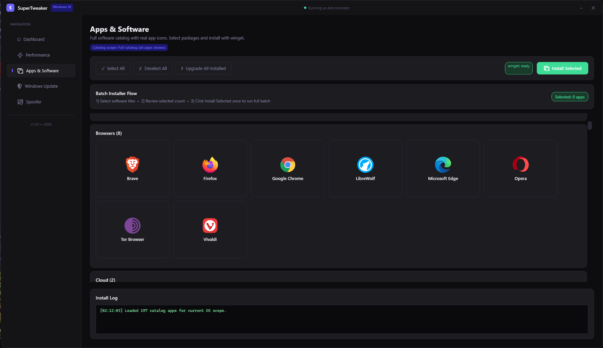

# SuperTweaker

### *Your Windows. One calm place to tune it, load it, and own it.*

 

**[⬇ Releases — MSI & portable](https://github.com/NilyTnily/SuperTweaker/releases)** · *No dev tools required — install the MSI or unzip and run.*

---

> **SuperTweaker** is for anyone who lives on Windows and wants **clarity** before they change anything: what your machine is doing, what you’re about to tweak, and **one honest hub** for grabbing apps at scale. Dark UI, sharp telemetry, and guardrails when you’re ready to move.

Windows **10** and **11** are **picked up automatically** — the right profiles and scope follow your OS, not the other way around.

### Contents

- [See it in action](#see-it-in-action)
- [What makes it feel *good*](#what-makes-it-feel-good)
- [Golden Setup](#golden-setup)
- [Apps & software catalog](#apps--software-catalog)
- [Download](#download)
- [Before you tweak](#before-you-tweak)
- [Contributing](#contributing)

---

## See it in action

  <b>System dashboard</b> — hardware, storage, security checks, and restore shortcuts in one screen.  
  

  <b>Apps &amp; software</b> — a big, icon-rich catalog: pick in bulk, install with winget, upgrade everything when you want.  
  

---

## What makes it feel *good*

| | |
|:---|:---|
| **Software hub** | Curated **categories**, real **icons**, **batch install**, **upgrade all** — built for fresh installs and power users who hate hunting installers one by one. |
| **Golden Setup** | Pick your tweaks. Optional **Sophia** debloat, optional **Hellzerg** hardware/latency tweaks — **not** overclocking. |
| **Windows Update** | **Disable / Enable** — large actions to turn Windows Update off or back on. |
| **Spoofer** *(advanced)* | **MAC** and **user-mode** identifiers with **snapshots** — reversible, scoped; no kernel drivers, no SMBIOS/firmware/EFI tampering, no mystery drivers. |

---

## Golden Setup

### Windows tweaks

1. Disable Telemetry (DiagTrack)  
2. Disable Bing Search / Web Results  
3. Disable Xbox Game Bar & DVR  
4. Disable Background UWP Apps  
5. Disable SysMain (Superfetch)  
6. Disable Windows Search Indexer  
7. Disable Print Spooler  
8. Set High Performance Power Plan  
9. Disable Hibernation (reclaim hiberfil.sys)  
10. Disable Cortana  
11. Disable Copilot / AI Recall  
12. Disable Widgets  
13. VBS / Memory Integrity — Info Tweak  
14. Disable Feedback / Notification spam  
15. Disable Scheduled Maintenance Tasks  
16. Network: Disable Interrupt Moderation  
17. ChrisTitus-style privacy tweaks  
18. Start / content cleanup  
19. Disable News & Interests (taskbar)  
20. Sophia-style Consumer Debloat  

---

## Apps & software catalog

`SuperTweaker/SuperTweaker/Data/apps/apps-catalog.json`

### AI Tools

- AnythingLLM  
- LM Studio  
- Ollama  
- Open WebUI Desktop  

### Backup

- AOMEI Backupper  
- Duplicati  
- Macrium Reflect  
- Restic  
- Rclone  
- Veeam Agent Free  

### Browsers

- Brave  
- Firefox  
- Google Chrome  
- LibreWolf  
- Microsoft Edge  
- Opera  
- Tor Browser  
- Vivaldi  

### Cloud

- Dropbox  
- Google Drive  

### Communication

- Discord  
- Signal  
- Telegram  
- Zoom  

### Containers & K8s

- k9s  
- kubectl  
- Lens  
- Podman  
- Podman Desktop  

### Databases

- AnotherRedisDesktopManager  
- DataGrip  
- DB Browser for SQLite  
- DBeaver  
- HeidiSQL  
- MongoDB Compass  
- MySQL Workbench  
- PostgreSQL  
- PostgreSQL pgAdmin  
- RedisInsight  
- TablePlus  

### Design

- Blender  
- Figma  
- GIMP  
- Inkscape  

### Dev Tools

- Docker Desktop  
- Git  
- GitHub Desktop  
- Go  
- IntelliJ IDEA Community  
- JetBrains Toolbox  
- Node.js LTS  
- Postman  
- PowerShell 7  
- PyCharm Community  
- Python 3.12  
- Rider  
- Rust  
- Sublime Text  
- Temurin JDK 21  
- Visual Studio 2022 Community  
- VS Code  
- Windows Terminal  

### Disk Tools

- AOMEI Partition Assistant  
- MiniTool Partition Wizard  

### Forensics

- Autopsy  
- Volatility 3  

### Game Development

- Epic Games Launcher Unreal  
- Godot Engine  
- Unity Hub  

### Gaming

- Battle.net  
- EA app  
- Epic Games Launcher  
- GeForce Experience  
- GOG Galaxy  
- Playnite  
- Prism Launcher  
- Riot Client  
- Steam  
- Ubisoft Connect  

### Media

- Audacity  
- DaVinci Resolve  
- Equalizer APO  
- FFmpeg  
- HandBrake  
- ImageGlass  
- Kdenlive  
- MPC-BE  
- NVIDIA Broadcast  
- OBS Studio  
- REAPER  
- Shotcut  
- Spotify  
- Streamlabs Desktop  
- VLC  
- Voicemeeter  

### Mobile Development

- Android Studio  
- Flutter SDK  

### Networking

- FileZilla  
- GlassWire  
- NetLimiter  
- OpenVPN Connect  
- PuTTY  

### Open Source Tweakers

- Chris Titus WinUtil  
- ExplorerPatcher  
- O&O ShutUp10++  
- Open-Shell  
- Optimizer (Hellzerg)  
- Sophia Script  
- ThisIsWin11  
- Win10Privacy  
- Win11Debloat  
- Winaero Tweaker  

### Package Managers

- Chocolatey  
- Scoop  
- UniGetUI  

### Productivity

- draw.io Desktop  
- Foxit PDF Reader  
- Joplin  
- LibreOffice  
- Notion  
- Obsidian  
- ONLYOFFICE Desktop  
- PDF-XChange Editor  
- Thunderbird  
- Typora  

### Remote

- AnyDesk  
- Parsec  
- RustDesk  
- TeamViewer  

### Reverse Engineering

- Cutter  
- dnSpyEx  
- Ghidra  
- ImHex  
- x64dbg  

### Security

- Bitwarden  
- Burp Suite Community  
- Cloudflare WARP  
- Cloudflared  
- Fiddler Classic  
- Hashcat  
- John the Ripper  
- KeePassXC  
- Malwarebytes  
- Nikto  
- Nmap  
- OWASP Dependency-Check  
- OWASP ZAP  
- ProtonVPN  
- Simplewall  
- Tailscale  
- Wireshark  
- ZeroTier One  

### System Info

- CPU-Z  
- CrystalDiskInfo  
- CrystalDiskMark  
- GPU-Z  
- HWiNFO64  
- MSI Afterburner  
- Process Explorer  

### System Tools

- AIDA64 Extreme  
- Autoruns  
- Cinebench  
- FanControl  
- LatencyMon  
- OCCT  
- ProcDump  
- Process Monitor  
- Snappy Driver Installer Origin  
- Sysinternals Suite  
- Sysmon  
- TCPView  
- WinDbg Preview  

### Terminals

- Cmder  
- fzf  
- Hyper  
- Nushell  
- Oh My Posh  
- ripgrep  
- Starship Prompt  
- WSL  

### Utilities

- 7-Zip  
- BalenaEtcher  
- BleachBit  
- Bulk Rename Utility  
- EarTrumpet  
- Everything Search  
- EverythingToolbar  
- Notepad++  
- PeaZip  
- PowerToys  
- qBittorrent  
- Rufus  
- ShareX  
- Twinkle Tray  
- WinRAR  

### Virtualization

- VirtualBox  
- VMware Workstation Player  

---

## Download

| | |
|:---|:---|
| **MSI** | Full installer — lives like any serious Windows app. |
| **Portable ZIP** | Extract anywhere — self-contained **`SuperTweaker.exe`** plus **`Data`** / **`Assets`**. |

Grab the latest from **[Releases](https://github.com/NilyTnily/SuperTweaker/releases)**.

---

## Before you tweak

Back up first (restore point or image). Disabling **Windows Update** is a tradeoff — only when you understand it. Use **Spoofer** responsibly and legally.

---

## Contributing

Issues and PRs are welcome. Source lives under `SuperTweaker/`. Before a PR: `dotnet test SuperTweaker/SuperTweaker.sln`.

---

 

**SuperTweaker** — *Less tab-hopping. More “I actually know what this PC is doing.”*

